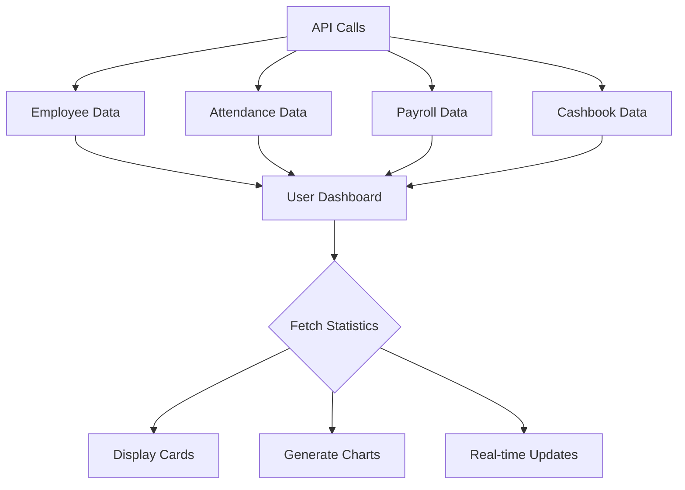
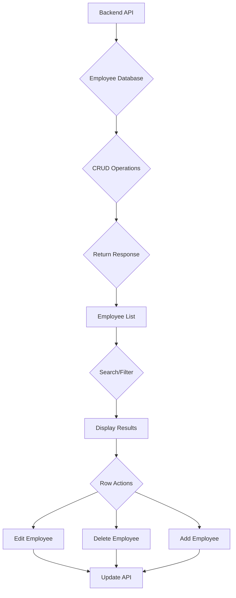
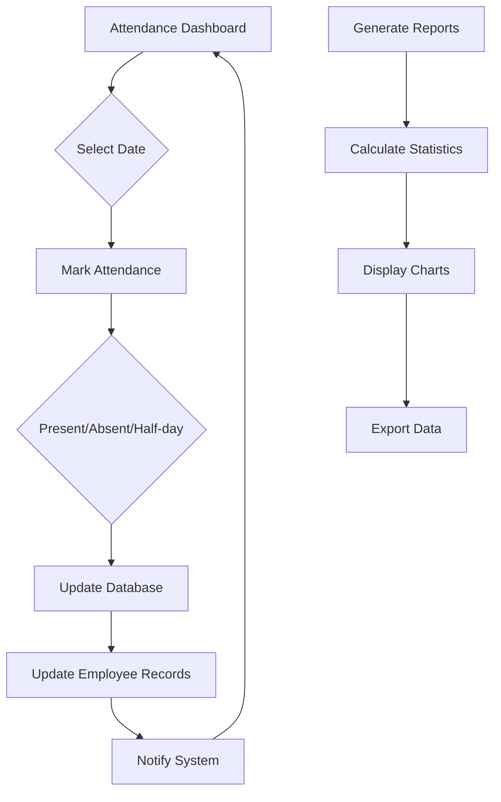
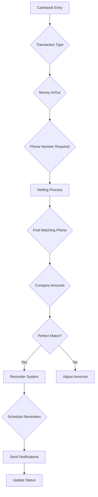
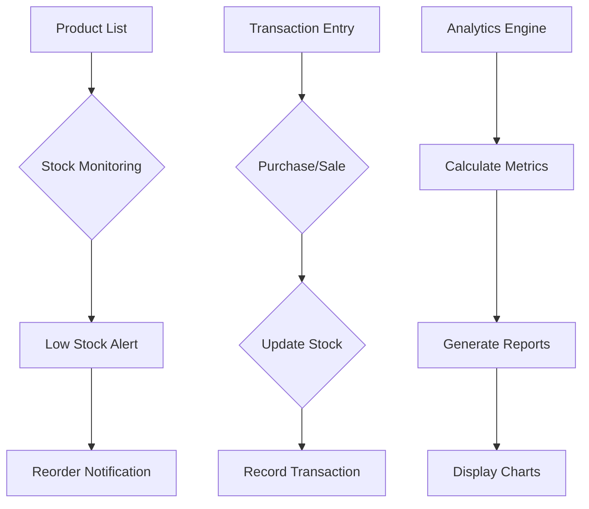
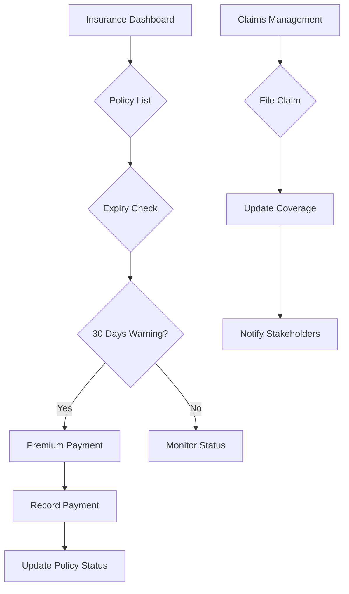
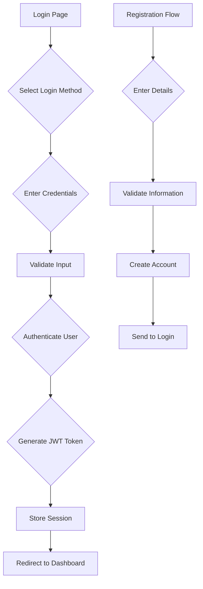
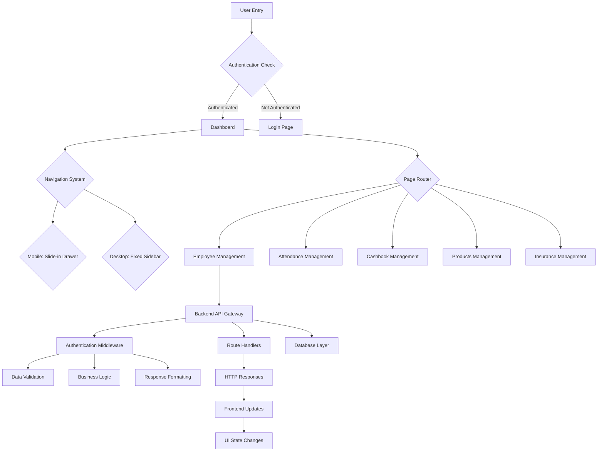
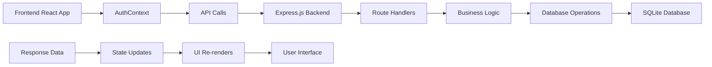

# BizManage Application Documentation

## 📋 Table of Contents

1. [Application Overview](#application-overview)
2. [Authentication & Navigation](#authentication--navigation)
3. [Page-by-Page Analysis](#page-by-page-analysis)
   - [Dashboard](#dashboard)
   - [Employee Management](#employee-management)
   - [Attendance Management](#attendance-management)
   - [Cashbook Management](#cashbook-management)
   - [Products Management](#products-management)
   - [Insurance Management](#insurance-management)
   - [Login Page](#login-page)
4. [Application Flow Chart](#application-flow-chart)
5. [Key Features & Technologies](#key-features--technologies)

---

## Application Overview

BizManage is a comprehensive business management system built with React and Material-UI. It features a mobile-first responsive design with a collapsible sidebar navigation system.

**Key Characteristics:**
- 📱 Mobile-first responsive design
- 🎛 Collapsible sidebar (70px collapsed / 250px expanded)
- 🔄 Real-time data synchronization
- 📊 Rich dashboard with analytics
- 💰 Financial management (cashbook, payroll)
- 👥 Human resource management (employees, attendance)
- 📦 Inventory management (products)
- 🛡️ Insurance policy management

---

## Authentication & Navigation

### Authentication Context
- **File**: `src/contexts/AuthContext.js`
- **Purpose**: Centralized authentication state management
- **Features**: Login, logout, user data persistence

### Navigation System
- **Mobile**: Slide-in drawer with backdrop overlay
- **Desktop**: Fixed sidebar with collapse/expand functionality
- **Responsive Breakpoints**:
  - Mobile: `< md` (slide-in drawer)
  - Desktop: `>= md` (fixed sidebar)

### Sidebar Components
- **File**: `src/components/Sidebar.js`
- **Features**:
  - Mobile: Hidden by default, slides in from left
  - Desktop: Collapsible with smooth transitions
  - Auto-close on navigation (mobile)
  - Tooltips on collapsed state

### TopBar Component
- **File**: `src/components/TopBar.js`
- **Features**:
  - Page title display
  - Hamburger menu (mobile)
  - Sidebar toggle button (desktop)
  - User account menu
  - Notifications badge

---

## Page-by-Page Analysis

### Dashboard

**Route**: `/` | **File**: `src/pages/Dashboard.js`

#### 🎯 Purpose
Central analytics and business overview hub

#### 🔧 Key Features
1. **Business Statistics Cards**
   - Total Payments (in + out)
   - Total Given (outgoing)
   - Total Received (incoming)
   - Current Balance

2. **Data Visualization**
   - Line charts for trends
   - Pie charts for distribution
   - Bar charts for comparisons
   - Responsive containers using Recharts

3. **Real-time Updates**
   - Auto-refresh data
   - Loading states
   - Error handling

#### 📊 Data Sources
- Employee count
- Attendance records
- Payroll summaries
- Cashbook balances
- Product inventory values

#### 🔄 Logic Flow

---

### Employee Management

**Route**: `/employees` | **File**: `src/pages/Employees.js`

#### 🎯 Purpose
Complete employee lifecycle management with CRUD operations

#### 🔧 Key Features
1. **Employee Database**
   - Add/Edit/Delete employees
   - Personal information management
   - Job details and roles
   - Contact information

2. **Advanced Search & Filtering**
   - Real-time search across all fields
   - Sort by name, department, position
   - Filter by employment status

3. **Data Table Management**
   - Paginated results (50 per page)
   - Sortable columns
   - Inline editing capabilities
   - Bulk operations support

4. **Dialog-based Operations**
   - Modal forms for add/edit
   - Form validation
   - Success/error feedback

#### 🔄 Logic Flow

---

### Attendance Management

**Route**: `/attendance` | **File**: `src/pages/Attendance.js`

#### 🎯 Purpose
Track and manage employee attendance with multiple marking methods

#### 🔧 Key Features
1. **Attendance Recording**
   - Present/Absent/Half-day marking
   - Date-wise attendance tracking
   - Bulk attendance operations
   - Monthly attendance summaries

2. **Calendar Integration**
   - Date picker for attendance marking
   - Monthly calendar view
   - Holiday management
   - Working day calculations

3. **Analytics & Reporting**
   - Attendance statistics
   - Presentee percentage calculations
   - Monthly/weekly reports
   - Visual attendance charts

4. **Employee Status Tracking**
   - Real-time status updates
   - Attendance history
   - Pattern analysis

#### 🔄 Logic Flow

---

### Cashbook Management

**Route**: `/cashbook` | **File**: `src/pages/Cashbook.js`

#### 🎯 Purpose
Financial transaction management with automatic netting capabilities

#### 🔧 Key Features
1. **Transaction Management**
   - Add/Edit/Delete transactions
   - Two types: Money In (Received) / Money Out (Given)
   - Mandatory phone numbers for netting
   - Automatic netting by phone number

2. **Advanced Netting System**
   - Automatic pairing of opposite transactions
   - Perfect match deletion
   - Partial match amount adjustment
   - Manual net-all functionality
   - Phone number as unique identifier

3. **Proof & Documentation**
   - Receipt/invoice/bank statement support
   - Proof description fields
   - Document attachment capability

4. **Reminder System**
   - Automated reminders for money given out
   - WhatsApp integration ready
   - Custom reminder messages
   - Interval-based scheduling

#### 🔄 Logic Flow

---

### Products Management

**Route**: `/products` | **File**: `src/pages/Products.js`

#### 🎯 Purpose
Inventory and stock management with transaction tracking

#### 🔧 Key Features
1. **Product Catalog**
   - Complete product information management
   - SKU and barcode support
   - Category organization
   - Stock level tracking

2. **Transaction Management**
   - Purchase transactions (stock in)
   - Sale transactions (stock out)
   - Stock adjustment capabilities
   - Transaction history

3. **Stock Monitoring**
   - Low stock alerts
   - Reorder level calculations
   - Stock movement tracking
   - Value calculations

4. **Analytics Dashboard**
   - Product performance metrics
   - Stock value calculations
   - Transaction summaries
   - Visual charts and reports

#### 🔄 Logic Flow

---

### Insurance Management

**Route**: `/insurance` | **File**: `src/pages/Insurance.js`

#### 🎯 Purpose
Insurance policy and premium management for business assets

#### 🔧 Key Features
1. **Policy Management**
   - Complete policy information
   - Premium amount tracking
   - Policy expiration monitoring
   - Company and contact details

2. **Expiry Tracking**
   - Automated expiry alerts
   - 30-day advance warnings
   - Color-coded status indicators
   - Renewal notifications

3. **Document Management**
   - Policy document storage
   - Premium payment records
   - Claims tracking capability
   - Multi-file support

4. **Analytics & Reporting**
   - Total premiums calculation
   - Active/expired policy counts
   - Coverage summaries
   - Expiry timeline

#### 🔄 Logic Flow

---

### Login Page

**Route**: `/login` | **File**: `src/pages/Login.js`

#### 🎯 Purpose
Secure user authentication and session management

#### 🔧 Key Features
1. **Multi-Method Login**
   - Phone number authentication
   - Password-based login
   - Remember me functionality
   - Session persistence

2. **User Experience**
   - Tab-based interface (Login/Register)
   - Password visibility toggle
   - Real-time validation
   - Loading states

3. **Security Features**
   - Input validation and sanitization
   - Brute force protection
   - Session management
   - Secure token handling

4. **Responsive Design**
   - Mobile-optimized layout
   - Touch-friendly interface
   - Cross-browser compatibility

#### 🔄 Logic Flow

---

## Application Flow Chart

### Overall Application Architecture

### Data Flow Architecture

---

## Key Features & Technologies

### 🛠️ Core Technologies

#### Frontend Stack
- **React 18**: Component-based architecture
- **Material-UI v5**: UI component library
- **React Router v6**: Client-side routing
- **Recharts**: Data visualization
- **Moment.js**: Date/time handling
- **Axios**: HTTP client (implied)

#### Backend Stack
- **Node.js**: JavaScript runtime
- **Express.js**: Web framework
- **SQLite**: Database management
- **Knex.js**: Query builder
- **JWT**: Authentication tokens
- **bcryptjs**: Password hashing

### 🎨 Design System

#### Responsive Design
- **Mobile-First Approach**: Progressive enhancement
- **Breakpoint System**: 
  - Mobile: `< 768px`
  - Tablet: `768px - 1024px`
  - Desktop: `> 1024px`
- **Collapsible Navigation**: Space-efficient sidebar

#### UI/UX Features
- **Dark/Light Theme Support**: Material-UI theming
- **Accessibility**: ARIA labels, keyboard navigation
- **Loading States**: Skeleton screens, progress indicators
- **Error Handling**: User-friendly error messages
- **Real-time Updates**: Live data synchronization

### 🔒 Security Features

#### Authentication & Authorization
- **JWT-based Authentication**: Secure token system
- **Password Hashing**: bcryptjs encryption
- **Session Management**: Secure token storage
- **Route Protection**: Authentication middleware
- **Input Validation**: XSS protection

#### Data Security
- **SQL Injection Prevention**: Parameterized queries
- **Rate Limiting**: DDoS protection
- **CORS Configuration**: Cross-origin resource sharing
- **Helmet.js**: Security headers

### 📊 Analytics & Reporting

#### Dashboard Analytics
- **Business Metrics**: KPI tracking
- **Financial Summaries**: Cashbook insights
- **Employee Statistics**: Headcount, attendance
- **Performance Charts**: Trend analysis
- **Export Capabilities**: Data download features

#### Real-time Monitoring
- **Live Updates**: WebSocket ready
- **Change Detection**: Auto-refresh on data changes
- **Notification System**: Alert management
- **Status Tracking**: System health monitoring

---

## 🚀 Deployment & Performance

### Development Environment
- **Frontend**: React Dev Server (Port 3000+)
- **Backend**: Express Server (Port 5000)
- **Database**: SQLite with Knex migrations
- **Hot Reload**: Live code updates

### Production Considerations
- **Build Optimization**: Code splitting, lazy loading
- **Asset Optimization**: Image compression, caching
- **Security Hardening**: HTTPS, security headers
- **Scalability**: Load balancing, database optimization
- **Monitoring**: Error tracking, performance metrics

---

## 📝 Development Guidelines

### Code Organization
- **Component Structure**: Reusable UI components
- **Page Organization**: Feature-based file structure
- **Utility Functions**: Shared helper functions
- **Context Management**: Global state handling

### Best Practices
- **Error Boundaries**: Graceful error handling
- **Loading States**: Progressive enhancement
- **Form Validation**: User input protection
- **Responsive Design**: Mobile-first approach
- **Performance**: Optimized re-renders

---

## 🔧 API Documentation

### Authentication Endpoints
- `POST /api/auth/login` - User authentication
- `POST /api/auth/register` - User registration
- `GET /api/auth/profile` - User profile data

### Business Management Endpoints
- `GET /api/employees` - Employee listing
- `POST /api/employees` - Employee creation
- `PUT /api/employees/:id` - Employee updates
- `DELETE /api/employees/:id` - Employee deletion

### Financial Management Endpoints
- `GET /api/cashbook` - Transaction listing
- `POST /api/cashbook` - Transaction creation
- `PUT /api/cashbook/:id` - Transaction updates
- `DELETE /api/cashbook/:id` - Transaction deletion
- `POST /api/cashbook/net-manual` - Manual netting

### Inventory Endpoints
- `GET /api/products` - Product listing
- `POST /api/products` - Product creation
- `PUT /api/products/:id` - Product updates
- `DELETE /api/products/:id` - Product deletion
- `POST /api/products/:id/transactions` - Stock transactions

---

## 🎯 Future Enhancements

### Planned Features
1. **Advanced Analytics**
   - Predictive analytics
   - Custom report builder
   - Data export in multiple formats

2. **Mobile Application**
   - React Native mobile app
   - Offline capabilities
   - Push notifications

3. **Integration Capabilities**
   - Third-party API integrations
   - Webhook support
   - Zapier automation

4. **Performance Optimizations**
   - Caching strategies
   - Database optimization
   - CDN implementation
   - Service workers

---

*This documentation provides a comprehensive overview of the BizManage application architecture, features, and implementation details.*
